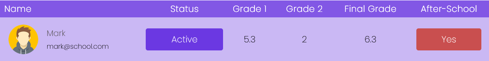
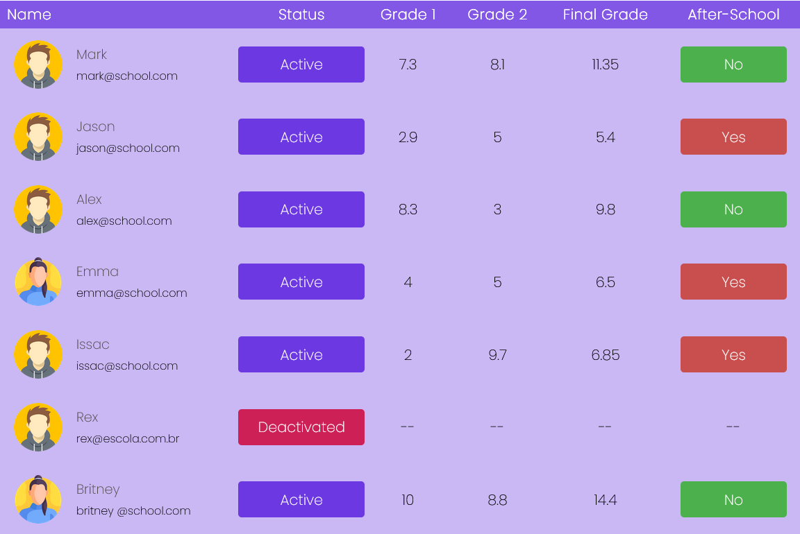

# Média Escolar UI.
    
Projeto que calcula a média escolar dos alunos dinamicamente, dependendo da média o aluno deverá ou não realizar o "After-School" (recuperação).
 
Insert de dados apenas por codigo Pasta "src/data/Student.ts" caso queira adicionar um novo Estudante.

# A média escolar nesse projeto é 7 

# ScreenShot

# Caso o aluno tenha sua nota abaixo da média:

# Caso o aluno tenha sua nota acima ou igual:

# Caso o aluno esteja desativado:

# Exemplo de uma listagem completa:

## Criado com

- Typescript
- React/Vite
- Css

## Desktop ✔️
## Mobile ❌

## Author

- [@WDYitz] Yitzhak B.Rodriguez
